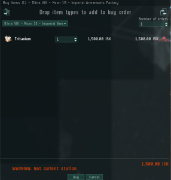
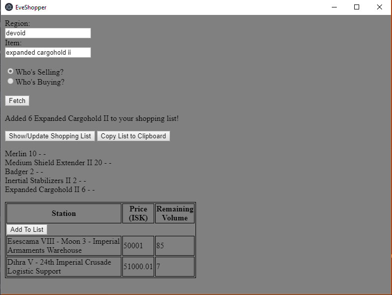

# EveShopper

Welcome to EveShopper, the app for creating a shopping cart for EVE Online! Currently it gets items by region, but soon I'll add the ability to:

- Display the prices of the item in federation space (you will be able to select "Caldari" for example to get all prices in Caldari space) and the description of the item
- Export your list to the clipboard so you can paste it into EVE

Currently there is no icon for the app.

# HOW TO USE

1. Search a region and item, and choose "Who's Buying?" or "Who's Selling?"
2. Click "Fetch".
3. If you chose "Who's Selling?", you'll have the option to add the item to the list. Click on that button and follow the prompt that will appear.
4. Click the button that says "Show/Update Shopping List". If you clicked it and added a item, don't worry! Just click it again and it will refresh the list, displaying the new item.
5. Highlight and copy the list that appears.
6. In EVE, open the Multibuy window and click the button in the top left and import from the clipboard. 

Example screenshot: 

Modules are not included, please use `npm install` to install them.

This currently uses Electron `v4.1.0`, Axios `v0.18.0`, and NodeJS `v10.15.3`.
