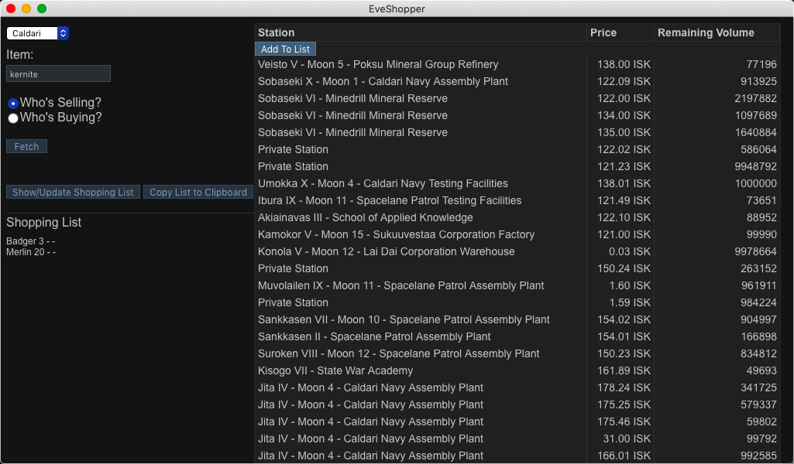

# EveShopper

Welcome to EveShopper, the app for creating a shopping list for EVE Online!

Current Version: [1.3.0](https://github.com/GingkathFox/EveShopper/releases/tag/v1.3.0)

# FEATURES

EveShopper can:
- Display the prices of the item in federation space (you can select "Caldari" for example to get all prices in Caldari space)

- Export your list to the clipboard so you can paste it into EVE

It's also useful for miners too, since you can see which stations are buying your ore for the highest price!

# HOW TO USE

1. Search a region and item, and choose "Who's Buying?" or "Who's Selling?"
2. Click "Fetch".
3. If you chose "Who's Selling?", you'll have the option to add the item to the list. Click on that button and follow the prompt that will appear.
4. Click the button that says "Show/Update Shopping List". If you clicked it and added a item, don't worry! Just click it again and it will refresh the list, displaying the new item.
5. Click "Copy List to Clipboard".
6. In EVE, open the Multibuy window and click the button in the top left and import from the clipboard. 

Example screenshot: 
